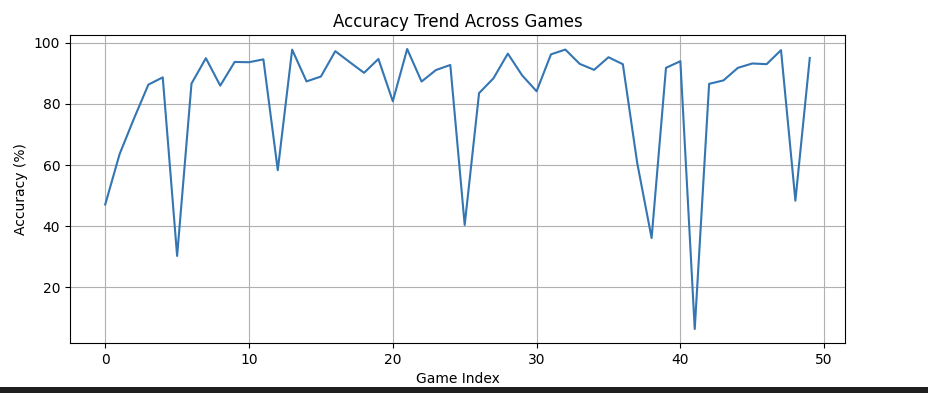
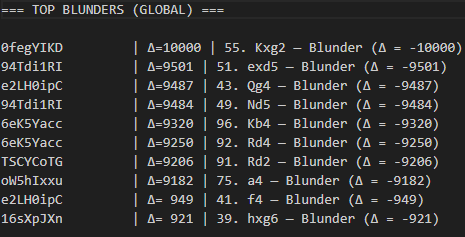
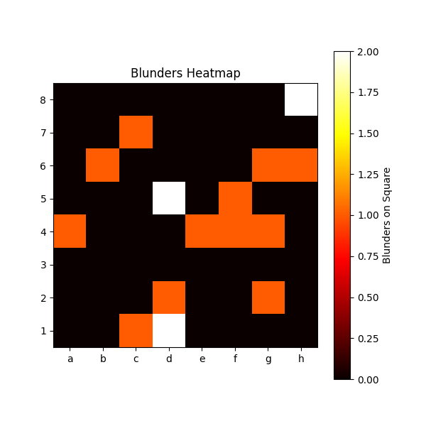
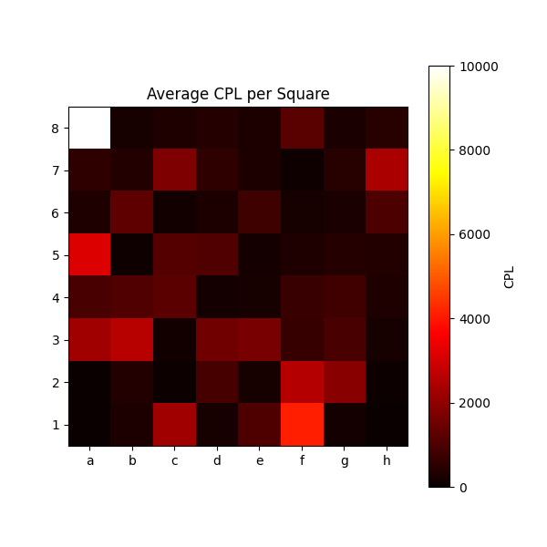
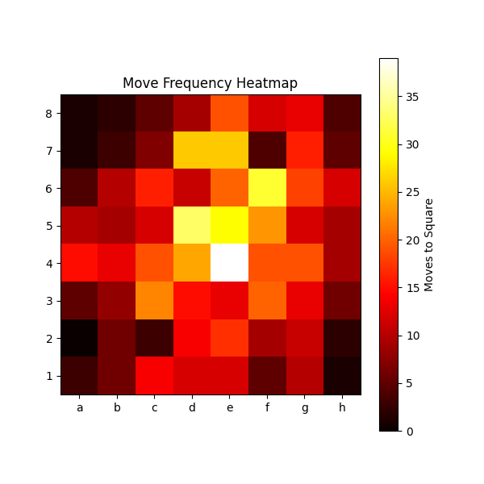

# LiLLeM.chess
<h2>Tool for chess game analysis</h2>
<h3>Some statistics</h3>
 Integration with lichess API for:
<ul>
<li>rapid</li>
<li>blitz</li>
<li>bullet</li>
</ul>
 Example CPL evaluation

 Trend history accross last 50 games

 Top blunders from last games

 Heatmaps example

<h3> LLM for a game analysis</h3>
 Dependencies
 pip install torch torchvision torchaudio --index-url https://download.pytorch.org/whl/cu124
 pip install transformers accelerate einops safetensors sentencepiece huggingface_hub
 pip install python-chess
 pip install matplotlib
 pip install seaborn
 pip install langchain faiss-cpu sentence-transformers
 pip install langchain langchain-community langchain-core
 pip install faiss-cpu
 pip install protobuf google
  pip install python-chess stockfish transformers torch dotenv requests

 
 <b>Important! - </b>run_llm_game_by_id , for instance: python run_llm_game_by_id.py last [username]
 In my case: python run_llm_game_by_id.py last bielbart77
<h2>First version with Stockfish</h2>
 two files are important: run_llm_game_by_id.py and LLMChessAnalyzer.py
 call example: python run_llm_game_by_id.py last {playerName}
<h3>[INFO] Fetch & moves</h3>

<pre><code>[INFO] Fetching last game for bielbart77...

=== MOVES ===
1. c4 d5 2. cxd5 Qxd5 3. Nc3 Qd8 4. Nf3 Bf5 5. g3 e6 6. Bg2 a6 7. Nd4 Qxd4 8. Bxb7 Ra7 9. Bg2 Bc5 10. e3 Qd3 11. Bf1 Qd6 12. Bg2 Ne7 13. O-O Bb4 14. Qa4+ Nbc6 15. Bxc6+ Nxc6 16. d4 Bxc3 17. bxc3 Qd5 18. Ba3 Qf3 19. Qd1 Qd5 20. f3 h6 21. e4 Qa5 22. Bc5 Bh3 23. Bxa7 Bxf1 24. Kxf1 Nxa7 25. Qb3 Qb5+ 26. Qxb5+ Nxb5 27. Rb1 O-O 28. Rb3 Rd8 29. Ke2 Rd6 30. Ke3 Rb6 31. c4 Na7 32. c5 Rxb3+ 33. axb3 Nb5 34. d5 exd5 35. exd5 Kf8 36. Ke4 f6 37. Kf5 Kf7 38. b4 g6+ 39. Ke4 Ke7 40. f4 Nc3+ 41. Kd4 Ne2+ 42. Ke4 Nc1 43. g4 Na2 44. h4 Nxb4 45. g5 hxg5 46. f5 gxf5+
=============
</code></pre>

<h3>[INFO] Initialization</h3>
<pre><code>[INFO] Initializing LLM analyzer...
[LLMChessAnalyzer] Loading model...
Loading checkpoint shards: 100%|███████████████████████████████████████████████████████████████████████████████████████████| 3/3 [00:00<00:00, 20.87it/s]
The module name  (originally ) is not a valid Python identifier. Please rename the original module to avoid import issues.
[LLMChessAnalyzer] Model loaded successfully.
[LLMChessAnalyzer] Stockfish initialized.
[INFO] Generating analysis...

Setting `pad_token_id` to `eos_token_id`:2 for open-end generation.
</code></pre>

<h3>LLM Analysis</h3>
<pre><code>=========== LLM ANALYSIS ===========

Move 7: Nd4
Reason: This move weakens the d4 pawn, which can be targeted by the opponent. It also blocks the bishop on c1 from participating in the game, as it cannot move to d2 due to the knight on d4. This move also does not support the pawn on d4, which can be a target for a pawn advance by the opponent.

Move 30: Ke3
Reason: This move weakens the king's position, making it more vulnerable to attacks. It also blocks the bishop on c1 from moving, reducing its activity. Additionally, the king's position on e3 does not support the pawn on e4, which can be a target for a pawn advance by the opponent. This move also does not create any threats or put pressure on the opponent's position, making it a passive move.
</code></pre>

<h3>Worst moves (Stockfish)</h3>
<pre><code>=========== WORST MOVES (Stockfish) ===========
Move 7: Nd4 (eval change: -424)
Move 30: Ke3 (eval change: -300)
</code></pre>
<h3>Summary</h3>

  ✅ Proper game loaded from lichess 
  ✅ Correct moves are displayed 
  ✅ Stockfish made moves analysis 
  ✅ Stockfish found worst moves (n=2) 
  
  ❌ Mistral7B did wrong blunders interpretation. Doesn't understand idea of blunders - further investigation needed.   

